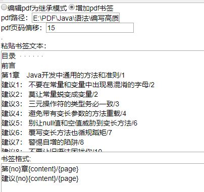
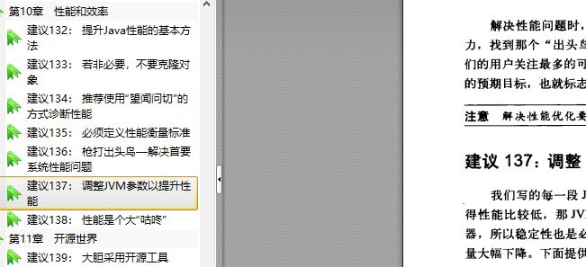

# pmark
pdf书签生成工具和编辑工具。

个人收集了不少pdf，有的没有书签，不能跳页不方便。
有的书签每次跳页会把缩放页面。

针对这两个最常用的需求，实现一个简单的功能。

不想学javaFx，不喜欢 .net, (从wpf一路被微软坑的过来人)。考虑之后用springboot做一个内嵌tomcat的web页面。

复制当当或者亚马逊或者京东或者豆瓣的书签内容到txt中，即可为pdf生成书签。书签有层级，可跳转页码。
编辑全部书签可让书签跳转时不会缩放，即按照档当前的缩放比例。

此操作会删除已存在的书签，并新增书签，但不会对pdf中的文字和图形注释以及其他的产生影响。

提交后会在pdf同级目录生成一个XX-带书签.pdf的文件，为处理完成后的pdf文件。

## 操作方法

如图

1. 页码偏移：pdf文件从封面就开始计算页码，而目录页码是书上标的页码。偏移即差值
2. 路径：pdf的绝对路径
3. 书签文本：从上面说的网站粘贴过来
4. 书签格式：{no}-数字序号，{content}- 内容,{page}-页码,不需要指定空格，每行代表一个层级，制作折叠书签。
注意{no}和{page}只包含数字，{content}表示除了no外要在书签中显示的内容
比如：传播过度的社会　/9 。这里没有序号，有页码，但是不希望书签中包含/，即定义格式{content}/{page}

## 运行

    java -jar pmark-0.0.1-SNAPSHOT.jar
## 打开
    localhost:9999

## 待改进
- [ ] 页面，要美，可是，工作好累。
- [ ] 整理出大量pdf书签格式表达式，先是自动识别格式，不成功再按照占位符定义格式。
- [ ] 爬虫抓取以上网站并让用户选择正确或者详细的那个，使用语言初步定为node.js。